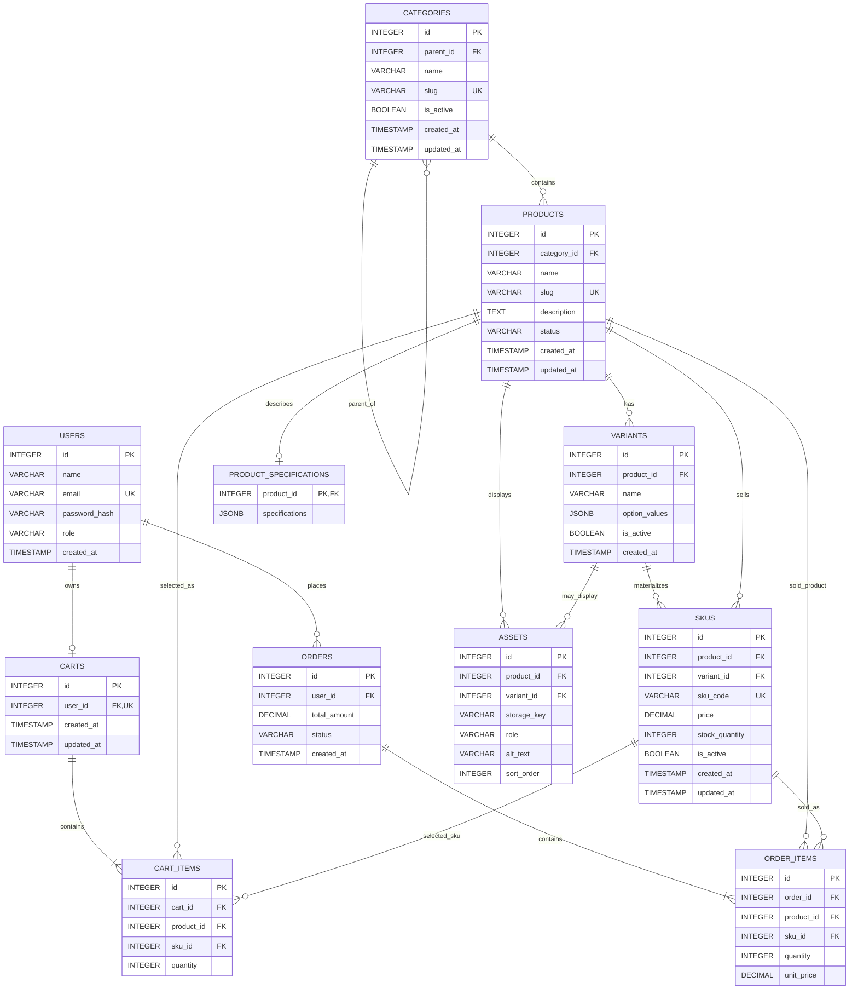

# FreshCart — Sprint 2: Catalog Data Foundation

## 1. Sprint goal and scope boundary

Sprint 2 converts the Sprint 1 FreshCart architecture into a reliable catalog data foundation. The implementation covers category hierarchy, product identity, variants, SKUs, prices, stock, database constraints, migrations, authenticated administration, seed data, and automated verification.

### In scope

- Category tree management with unique slugs, stable IDs, active status, and parent relationships.
- Product creation/editing with name, slug, description, status, and one canonical category.
- Product variants representing real option combinations.
- SKUs with unique codes, decimal prices, non-negative stock, and active status.
- Protected administrator operations for categories, products, variants, and SKUs.
- PostgreSQL migrations, seed data, and automated tests.

### Explicitly out of scope

Dynamic public specifications, asset upload, public catalog search, publication workflows, payment gateway integration, order placement, shipping integration, and the full shopper checkout flow remain Sprint 3 or later. The database contains planned `assets` and `product_specifications` structures so later sprints can extend the model without duplicating product identity.

## 2. Sprint 1 decisions reused or changed

Sprint 1 defines FreshCart as an online grocery and consumer-retail platform and identifies retail consumers/households as the primary persona. Its MVP includes authentication, product catalog, cart management, checkout/order processing, and inventory control. Sprint 1 selected React.js, Node.js + Express.js, PostgreSQL, and optional Redis. This sprint keeps those decisions and implements the Node.js/Express + PostgreSQL catalog foundation.

Sprint 1 already models `USERS`, `CATEGORIES`, `PRODUCTS`, `ORDERS`, `ORDER_ITEMS`, `CART`, and `CART_ITEMS`. Sprint 2 extends that model with `VARIANTS`, `SKUS`, and future-facing `ASSETS` and `PRODUCT_SPECIFICATIONS`; it does not replace the original cart/order entities.

## 3. Updated ERD and data dictionary

The Sprint 2 manual requires PK/FK types, cardinalities, and planned connections to Sprint 1 carts and orders. The following diagram records the implemented database direction.



### Data dictionary and relationship policies

| Entity | Important fields | Relationship/cardinality | Delete/update policy |
|---|---|---|---|
| `categories` | `id`, `parent_id`, `name`, `slug`, `is_active` | Category 0..1 parent; 1:N children; 1:N products | Parent delete uses `SET NULL`; ID updates cascade. Cycle is blocked by a PostgreSQL trigger. |
| `products` | `id`, `category_id`, `name`, `slug`, `description`, `status` | Category 1:N products; Product 1:N variants/SKUs | Category delete is restricted while products reference it. Product is normally archived instead of deleted. |
| `variants` | `id`, `product_id`, `name`, `option_values`, `is_active` | Product 1:N variants; Variant 1:N SKUs | Product delete cascades to variants/SKUs. Variant is normally deactivated. |
| `skus` | `id`, `product_id`, `variant_id`, `sku_code`, `price`, `stock_quantity`, `is_active` | Product 1:N SKUs; Variant 0:N SKUs | Product/variant delete cascades from product/variant; SKU is normally deactivated. |
| `assets` | `id`, owner FK, `storage_key`, `role`, `alt_text`, `sort_order` | Product/variant 1:N assets | Owner delete cascades. Upload API is Sprint 3+. |
| `product_specifications` | `product_id`, `specifications JSONB` | Product 1:0..1 specification document | Product delete cascades. Validation/public use is Sprint 3+. |
| `carts`, `cart_items` | Sprint 1 entities plus optional SKU reference | User 1:0..1 cart; Cart 1:N items | User/cart deletion cascades; product/SKU deletion is restricted to protect future cart meaning. |
| `orders`, `order_items` | Sprint 1 entities plus SKU identity | User 1:N orders; Order 1:N items; SKU 1:N sold items | User/product/SKU deletes are restricted once referenced by orders. |

### Money and inventory rules

- Prices use PostgreSQL `DECIMAL(12,2)`; floating-point money is not used.
- `stock_quantity` is an integer with a database `CHECK (stock_quantity >= 0)`.
- `sku_code` and catalog slugs are database-unique, not only API-validated.
- A SKU with a variant must reference a variant belonging to the same product; a database trigger rejects cross-product variant assignments.
- A missing variant combination is not represented by a fake zero-stock SKU. The seed demonstrates an unavailable 10 kg rice variant without creating a bogus SKU.

## 4. Administration route table with examples

All routes below except login require `Authorization: Bearer <JWT>` and an administrator role. Validation failures return HTTP 400; duplicate unique values return HTTP 409; authentication failures return HTTP 401; non-admin access returns HTTP 403.

| Method | Route | Purpose | Example request |
|---|---|---|---|
| POST | `/api/v1/admin/login` | Local admin authentication | `{"email":"admin@freshcart.local","password":"ChangeMe123!"}` |
| POST | `/api/v1/admin/categories` | Create category | `{"name":"Pantry","slug":"pantry","parent_id":1}` |
| GET | `/api/v1/admin/categories` | List category records | No body |
| PATCH | `/api/v1/admin/categories/:id` | Edit/deactivate fields | `{"is_active":false}` |
| DELETE | `/api/v1/admin/categories/:id` | Soft-deactivate category | No body |
| POST | `/api/v1/admin/products` | Create draft/published product | `{"name":"Rice","slug":"rice","category_id":2}` |
| GET | `/api/v1/admin/products` | List admin products | No body |
| PATCH | `/api/v1/admin/products/:id` | Edit product/status | `{"status":"published"}` |
| DELETE | `/api/v1/admin/products/:id` | Archive product | No body |
| POST | `/api/v1/admin/products/:id/variants` | Add a valid variant | `{"name":"5 kg","option_values":{"weight":"5kg"}}` |
| GET | `/api/v1/admin/products/:id/variants` | List product variants | No body |
| PATCH | `/api/v1/admin/variants/:id` | Edit/deactivate variant | `{"is_active":false}` |
| DELETE | `/api/v1/admin/variants/:id` | Deactivate variant | No body |
| POST | `/api/v1/admin/products/:id/skus` | Add validated SKU | `{"variant_id":2,"sku_code":"RICE-5KG","price":1850,"stock_quantity":10}` |
| GET | `/api/v1/admin/skus?product_id=2` | List SKU records | No body |
| PATCH | `/api/v1/admin/skus/:id` | Update price/stock/status | `{"stock_quantity":25}` |
| DELETE | `/api/v1/admin/skus/:id` | Deactivate SKU | No body |

### Example response shape

Successful create operations return the created database record with HTTP `201` for POST requests. List endpoints return `{ "data": [...] }`. Errors use a consistent shape such as:

```json
{
  "error": "duplicate_value",
  "detail": "Key (slug)=(pantry) already exists."
}
```

A duplicate slug or SKU therefore produces a clear client error instead of a server traceback. 

## 5. Data integrity and authorization decisions

### Category hierarchy

The database trigger walks parent references before accepting a category change. It rejects direct self-parenting and longer ancestor cycles. A deactivated parent remains a valid historical parent; existing children are not silently reassigned. An administrator can later choose a different parent through the category update route.

### Product/category assignment

A product has one canonical category in Sprint 2. This matches the Sprint 1 relational ERD and keeps catalog ownership simple for the MVP. A future many-to-many taxonomy can be introduced only with an explicit design change rather than hidden duplicate category links.

### Product/SKU lifecycle

A draft product may have zero SKUs while an administrator is preparing it. A product marked `published` is intended to have at least one active sellable SKU before Sprint 3 exposes it publicly; Sprint 2's admin API does not publish a product-facing storefront response and therefore does not claim to enforce the future publication workflow.

An out-of-stock SKU remains identifiable with `stock_quantity = 0` and may remain active for catalog/admin purposes. A SKU that is intentionally unavailable can additionally be marked `is_active = false`.

Two SKUs may share the same price. Each SKU owns its own price because variants can have independent pricing. There is no floating-point price and no hidden price override table in Sprint 2.

Negative stock is rejected both by request validation and by the PostgreSQL check constraint. Duplicate SKU codes and product/category slugs are rejected by database unique constraints.

Products referenced by future carts or orders should be archived/deactivated instead of physically deleted. Order records retain the SKU/product identity they used; this avoids losing historical meaning.

## 6. Seed-data and demonstration instructions

Run:

```bash
npm run migrate
npm run seed
```

The seed creates:

- Root category `Fresh Food` and child categories `Pantry` and `Beverages`.
- Three products: Fresh Milk 1L, Premium Basmati Rice, and Mango Juice.
- Multiple variants for the rice product: 1 kg, 5 kg, and an intentionally unavailable 10 kg combination with no fake SKU.
- Four SKUs: `MILK-1L`, `RICE-1KG`, `RICE-5KG`, and `JUICE-MANGO-1L` (the last is unavailable with zero stock and inactive status).
- A reproducible admin account from `ADMIN_EMAIL` / `ADMIN_PASSWORD`.

### Demonstration flow

1. Log in:

```http
POST /api/v1/admin/login
Content-Type: application/json

{"email":"admin@freshcart.local","password":"ChangeMe123!"}
```

2. Create a child category:

```http
POST /api/v1/admin/categories
Authorization: Bearer <REDACTED_TOKEN>
Content-Type: application/json

{"name":"Snacks","slug":"snacks","parent_id":1}
```

3. Create a product:

```http
POST /api/v1/admin/products
Authorization: Bearer <REDACTED_TOKEN>
Content-Type: application/json

{"name":"Chocolate Biscuits","slug":"chocolate-biscuits","description":"Cocoa biscuits.","status":"draft","category_id":4}
```

4. Create a variant:

```http
POST /api/v1/admin/products/4/variants
Authorization: Bearer <REDACTED_TOKEN>
Content-Type: application/json

{"name":"200 g","option_values":{"weight":"200g"}}
```

5. Create a SKU:

```http
POST /api/v1/admin/products/4/skus
Authorization: Bearer <REDACTED_TOKEN>
Content-Type: application/json

{"variant_id":4,"sku_code":"BISCUIT-200G","price":180,"stock_quantity":20}
```

6. Retrieve the records with the GET administration endpoints.

Tokens in this document are placeholders and are not real credentials.

## 7. Test strategy, command, and result

The automated suite is in `tests/sprint2.test.js` and covers:

- Required product and SKU fields.
- Negative price/stock rejection.
- Slug validation.
- Database uniqueness for product/category slugs and SKU codes.
- Database category-cycle trigger presence.
- Decimal money and non-negative stock constraints.
- Unauthenticated admin rejection (`401`).
- Authenticated non-admin rejection (`403`).
- Protected administrator product creation and archive behavior.

Run:

```bash
npm install
npm test
```

Expected result on a clean install: **10 tests passing**. The suite does not require a live PostgreSQL server because authorization and validation are tested independently from the database connection; the migration itself contains the production database constraints and triggers.

## 8. Known limitations and Sprint 3 backlog

- Public catalog reads/search are not implemented in Sprint 2.
- Dynamic specification validation is represented as a planned JSONB table but not exposed through public APIs.
- Asset upload/storage integration is not implemented.
- Product publication workflow is not a Sprint 2 claim.
- Shopper cart/checkout and payment gateway integration remain future work.
- The admin login is intentionally a small local demonstration endpoint; production deployment should add rate limiting, stronger operational secret management, refresh-token/session policy, audit logging, and account recovery.
- Sprint 3 should consume the same product/variant/SKU identities and should not create a second pricing or inventory model.
